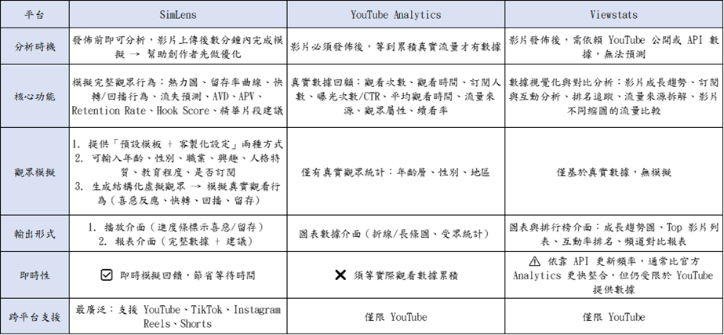
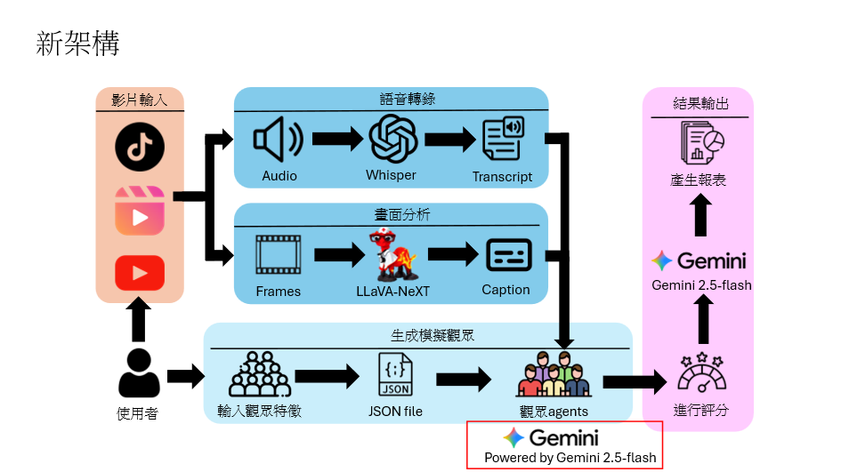

# SimLens 觀眾行為模擬：揭示短影音時序評論的關鍵密碼

## 一、創意發想背景及概述

隨著短影音在各大平台迅速崛起，創作者對「觀眾行為分析」的需求日益增加。然而，傳統用戶研究方法成本高、效率低，難以跟上快速迭代的內容產業。另一方面，現有的數據工具多依賴平台演算法，讓創作者往往需要在流量試錯的過程中付出高昂的時間與資源成本。例如，傳統的 YouTube Analytics 雖能提供詳細數據，但必須等到影片上線並累積流量後，才能看出觀眾的反應；其提供的點擊率、觀看數等資訊不僅具延遲性，創作者更常需等待數天甚至數週才能得到回饋，難以及時優化內容。而市面上其他模擬工具則多半侷限於整片評論生成，無法呈現觀眾在影片不同時間點的具體反應。

為突破現有數據工具的限制，我們開發了「SimLens」——一款專為短影音創作者打造的 AI 驅動觀眾反應預測平台。SimLens 將觀眾研究從被動的「整片回饋」推進至主動的「逐時間點反應預測」。我們聚焦於 2 分鐘左右的短影音內容，運用 AI 多代理觀眾模擬技術，在影片發佈前生成多樣化的虛擬觀眾群，並針對影片的每個時間段，產生對應該段內容的時序評論。透過這種段層級的反應分析能力，創作者能在發布前精準掌握「哪段內容對哪些受眾族群最有共鳴」，顯著降低試錯成本、加速影片優化週期。

## 二、作品功能簡介及特色

SimLens 的操作設計簡單直覺，使用者可直接上傳短影音檔案或貼上各大社群平台連結，系統將自動解析 2 分鐘左右的短影音內容。影片載入後，創作者可選擇一鍵套用常見受眾模板（如 8 種預設 persona），或自由輸入年齡、職業、興趣、語言風格等條件進行高度客製化，系統將建立具備真實行為邏輯的虛擬觀眾群進行深度模擬。

SimLens 的核心功能是「時序觀眾評論預測」：系統會將影片自動切分為多個時間片段，並針對每一個片段、每一個 persona，預測該觀眾在該時間點會留下的具體評論，並同時為每則評論進行正面、負面、中性的情感分類。若該 persona 在該時段沒有反應傾向，系統也會明確標註「無反應」，忠實還原真實觀眾並非每個時間點都會留言的特性。這些段層級的反應構成「12 段 × 8 persona」的反應矩陣（實際段數依後續實驗結果決定），每個矩陣單元同時記錄評論文字、情感極性與反應強度，完整呈現多元受眾在影片各時段的具體反應差異。

最終，系統會將反應矩陣交給另一個 LLM 進行整合，自動生成兩個層級的結構化分析報告。第一層為「逐評論建議」：針對矩陣中每一則 persona 評論，系統會根據該評論的情感極性與內容，提供具體可操作的改進建議——例如針對負面評論，系統會點出觀眾的具體不滿並給出修正方向；針對正面評論，則建議如何強化這個吸引點，使其在剪輯時能被進一步突出。第二層為「整片建議」：系統綜合分析整部影片的反應矩陣，產出涵蓋跨受眾比較（不同 persona 在同一段的反應差異）、persona 共鳴度分析（每個受眾族群最有共鳴的時段）、正負面情感熱區分布，以及整體節奏與內容調整方向的綜合建議。作為市面上首創的第三方 AI 影片時序評論預測平台，SimLens 的核心優勢在於將原本需等待數週的市場回饋濃縮至短短數分鐘，讓創作者在影片發布前就能清楚知道內容對不同族群的吸引力分佈與情感反應走向。

## 三、開發工具與技術

在系統架構與開發技術方面，SimLens 前端採用 Vue.js 作為主要框架，後端則使用 FastAPI 建構高效且具備高擴充性的 API 服務，並導入 Celery 處理繁重的非同步背景任務、結合 boto3 介接 MinIO 物件儲存服務處理影片檔案，專責處理影片上傳、分析任務調度與數據回傳。為了確保系統的穩定性與跨環境部署的便利性，我們導入了 Docker 進行環境容器化管理。底層資料庫則選用 PostgreSQL 作為核心，搭配 Redis 作為記憶體快取與任務訊息代理人，負責妥善儲存影片基本資料、模擬觀眾設定檔、系統分析結果與歷史數據，全面確保系統資料的一致性與可靠性。

在核心的 AI 技術應用上，SimLens 打造了一套無縫整合多種先進模型的影片理解與時序觀眾模擬管線，整體流程如下：

1. **視覺處理**：當影片輸入後，系統將影片切分為多個固定長度的片段（例如每 10 秒一段，實際秒數需透過實驗決定最佳分段策略），並對每個片段抽取代表性畫面，透過視覺語言模型 LLaVA-NeXT 將動態的影片畫面轉化為詳細的文字描述。

2. **音訊處理**：系統同時將整段影片的音軌一次性輸入 Whisper 語音辨識模型，產生帶有完整時間戳的轉錄文字。Whisper 的時間戳輸出讓我們能精準地知道每句話對應的影片時段。

3. **時序對齊**：系統依據時間軸將 LLaVA-NeXT 的視覺段描述與 Whisper 的轉錄時間戳進行對齊，把屬於同一時段的視覺描述與語音內容組合成「結構化文字片段」，將多模態資訊統一為 LLM 友善的文字表示。

4. **Persona 評論生成**：對齊後的時序文字一次性餵給由 Llama 3 系列大語言模型驅動的觀眾 agent。每個 agent 對應一個明確的 persona 設定（年齡、職業、興趣、語言風格、反應頻率等），系統針對每個（時段，persona）組合，預測該 persona 在該時段會產生的具體評論或標註「無反應」，並同時輸出該評論的情感極性（正面 / 負面 / 中性）。

5. **報告生成**：所有時序評論彙整為「段 × persona」的反應矩陣後，由另一個 LLM 進行兩層級報告整合。逐評論層級（cell-level）依據每則評論的情感極性，產出個別的優化建議；整片層級（video-level）綜合所有 persona 的時序反應，產出跨受眾比較、persona 共鳴度分析與整體節奏建議。

為提升小模型的領域表現，我們採用「蒸餾 + RLAIH」兩階段訓練方法：第一階段以 Claude 等大型模型生成的合成 persona 評論進行知識蒸餾，第二階段則透過本地部署的 Qwen3-32B 等模型作為多面向 reward judge，使用 DPO（Direct Preference Optimization）演算法進一步優化模型在 persona 一致性、語言風格匹配、段內相關性等領域指標的表現。

## 四、使用對象及環境

SimLens 主要服務於短影音創作生態圈，涵蓋多種使用場景。對於成熟的短影音創作者與網紅而言，平台能在影片發佈前預測各時段對不同 persona 的吸引力，讓他們在發布前就能調整內容節奏；對新進創作者來說，虛擬觀眾的時序反應模擬能補足數據上的劣勢，提供創作初期極為重要的客觀回饋。此外，SimLens 也是企業端與機構的強大輔助工具：影音製作公司與廣告代理商可將其應用於短廣告的市場前測；品牌與市場行銷團隊能藉此精準評估宣傳素材在不同時段對受眾的吸引力；而教育與培訓機構亦能透過分析學生對教學影片各時段的潛在反應，進一步優化教學內容的編排與節奏。

在系統使用環境方面，SimLens 是一款基於網頁架構開發的平台，主打高便利性與跨裝置相容性，使用者無需額外下載或安裝繁雜的軟體即可輕鬆運行。最低需求僅需具備穩定的網際網路連線，就能在 Windows、macOS 等主流作業系統上，透過桌上型電腦、筆記型電腦或平板搭配 Chrome、Edge、Safari 及 Firefox 等常見瀏覽器順暢使用。

## 五、產業應用性

SimLens 在短影音內容創作、社群行銷與電商產業中具備深遠的應用效益。透過先進的 AI 時序模擬技術，讓創作者與行銷人員能在內容發布前精準預測不同受眾在影片各時段的反應，大幅降低試錯成本並提升效率。這項技術不僅打破了高階數據分析的資源壁壘，讓資源有限的小型創作者也能輕鬆運用，進而活絡整體創作者經濟。

在商業佈局上，SimLens 具備成為高潛力 AI SaaS 平台的優勢，規劃透過常態訂閱、進階 AI 付費功能與企業級整合服務建立穩健營收。我們期望將服務對象從獨立創作者逐步拓展至更廣泛的商業客群，涵蓋活躍於 YouTube Shorts、Instagram Reels、TikTok 等短影音平台的專業團隊、Shopee 與 Shopify 上製作商品介紹短影音的電商賣家，以及專業行銷顧問公司等潛在 B2B 客戶。

此外，SimLens 採用輕量化模型架構（基於 Llama 3B 級別 student model），可在消費級 GPU 上完成推理，這也使其具備邊緣部署、隱私保護等優勢，滿足對資料隱私敏感的企業客戶需求。

## 六、結語

SimLens 不僅是一個短影音分析平台，更是一套「段層級 persona 反應預測系統」。它將觀眾研究從過往的「整片流量驗證」與「單一評論預測」提升至「逐時間點 × 多受眾的時序反應預測」，讓創作者能在影片發佈前就掌握不同受眾族群在影片各時段的具體反應。透過模型蒸餾與 RLAIH 強化學習，SimLens 證明了 3B 等級的小模型在缺乏真實觀影評價資料的領域，仍能透過合理的訓練設計，產出有意義且差異化的 persona 反應。

在短影音內容競爭激烈的時代，SimLens 代表的是一種新世代的創作流程：不再依靠運氣等待流量，而是透過 AI 驅動的時序觀眾模擬，更精準地預測並掌握影片每一段的真正價值。
